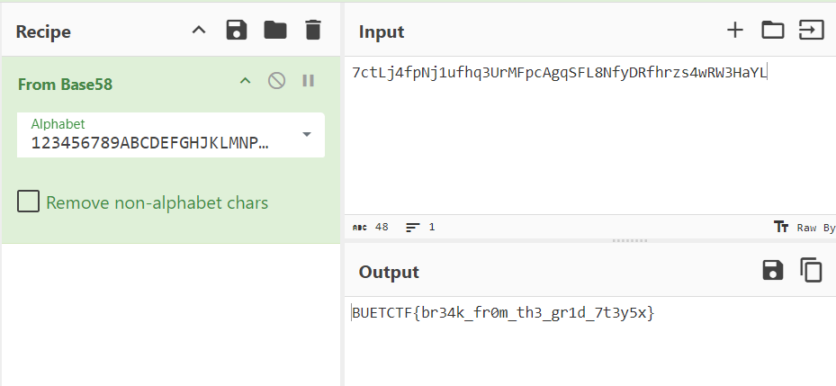

### Challenge title: Locked in The Grid

#### Points: 400 to 200

#### Flag:

```
 |  BUETCTF{br34k_fr0m_th3_gr1d_7t3y5x}
```

#### Author: 
##### [C0d3HuNt3r](https://github.com/Shehabul-Islam-Sawraz)

### Challenge Description

---

You managed to escape Noxhaven’s high-security prison once, but luck wasn’t on your side—you were caught again. This time, they've thrown you into the infamous Citadel, a place no one has escaped from. The prison’s security is old, but don’t underestimate it. To break free, you'll need to dig into the past. Sometimes, old systems hold the key to freedom...

N.B: The more you look, the more you see
N.B: The flag is encoded inside curly braces

***Hint:*** 
- Have you ever tried reversing a python function without code?
- Operations Code may come handy in the process

### Solution of Locked in The Grid

---

The main idea involves working with lower-level data present within a Python function's object. Python function objects have a `__code__` attribute that stores all the necessary details to recreate a function, even if the original source code is missing.

This attribute contains several properties, and the key ones are explained below:
- `co_code`: stores the bytecode instructions for the function
- `co_consts`: stores constants that are referenced in the function's code
- `co_varnames`: holds the local variable names used within the function
- `co_names`: includes all the global names referenced in the function

Our goal is to carefully examine and manipulate these attributes to reverse-engineer the function's behavior. You can check more about these [here](https://www.bravegnu.org/blog/python-byte-code-hacks.html).

At the heart of this challenge is the ability to inspect and manipulate Python bytecode. Python bytecode consists of low-level instructions that the Python interpreter executes. By interacting directly with the bytecode (i.e., the co_code), we can reconstruct the original functionality or even modify it.

One common tool for analyzing bytecode is the built-in [dis](https://docs.python.org/3/library/dis.html) module, which disassembles bytecode into [human-readable instructions](https://unpyc.sourceforge.net/Opcodes.html).

#### **Finding the flag function**

After some checking, we find out that we can use `print()`. There is no hint on how the challenge is structured. A good guess is that there is a `main` function.

```python
>> print(main.__code__)
<code object main at 0x000001C481618810, file "/srv/app/chal.py", line 72> 
```

This didn't trigger any error. Let's now see what this function calls upon.

```python
>> print(main.__code__.co_names)
('grid', 'KeyboardInterrupt', 'print')
```

`KeyboardInterrupt` and `print` are classic python functions. `grid` however, is not. Let's check upon other function calls.

```python
>> print(grid.__code__.co_names)
('input', 'print', 'ord', 'exec', 'secret', 'main', 'grid')
```

Once more, pretty standard functions, except for the one called `secret`. If we repeat the process one last time, we'll notice that there is no call on any fancy function. So, we found the flag function, that we have to reverse more in depth.

Let's run every function calls on this `secret` function, as we enumerated earlier.

```python
>> print(secret.__code__.co_code)
b'\x97\x00d\x01}\x01d\x02}\x02d\x03d\x00d\x00d\x04\x85\x03\x19\x00\x00\x00\x00\x00\x00\x00\x00\x00}\x03d\x05}\x04d\x06}\x05d\x07D\x00]\x1c}\x06|\x04t\x01\x00\x00\x00\x00\x00\x00\x00\x00\x00\x00|\x06|\x05z\x0c\x00\x00\xa6\x01\x00\x00\xab\x01\x00\x00\x00\x00\x00\x00\x00\x00z\r\x00\x00}\x04|\x05d\x08z\r\x00\x00}\x05\x8c\x1d|\x00d\x08\x19\x00\x00\x00\x00\x00\x00\x00\x00\x00}\x00t\x01\x00\x00\x00\x00\x00\x00\x00\x00\x00\x00t\x03\x00\x00\x00\x00\x00\x00\x00\x00\x00\x00|\x00\xa6\x01\x00\x00\xab\x01\x00\x00\x00\x00\x00\x00\x00\x00t\x03\x00\x00\x00\x00\x00\x00\x00\x00\x00\x00|\x00\xa6\x01\x00\x00\xab\x01\x00\x00\x00\x00\x00\x00\x00\x00z\x02\x00\x00d\tz\x05\x00\x00\xa6\x01\x00\x00\xab\x01\x00\x00\x00\x00\x00\x00\x00\x00}\x07d\x05}\x08d\nD\x00].}\x06t\x03\x00\x00\x00\x00\x00\x00\x00\x00\x00\x00|\x06\xa6\x01\x00\x00\xab\x01\x00\x00\x00\x00\x00\x00\x00\x00}\t|\td\x0bz\n\x00\x00d\x0cz\x06\x00\x00}\n|\x08t\x01\x00\x00\x00\x00\x00\x00\x00\x00\x00\x00|\n|\x01z\x0c\x00\x00\xa6\x01\x00\x00\xab\x01\x00\x00\x00\x00\x00\x00\x00\x00z\r\x00\x00}\x08\x8c/d\r}\x0b|\x02|\x03z\x00\x00\x00|\x04z\x00\x00\x00|\x07z\x00\x00\x00|\x08z\x00\x00\x00|\x0bz\x00\x00\x00}\x0cd\x0eS\x00'
>>
>> print(secret.__code__.co_consts)
(None, 79, '{7ctLj4', 'FSqgAcpFMrU3qhfu1jNpf', -1, '', 16, b'\\)\\umQDqpk`h(jL', 1, 87, 'ALs[', 69, 128, 'L}', '{8hHVpauQQYxfSCQodUoBn8uZWY9Pi952QC9WP13oDpQNt9cswHJxdBbadrY}')
>> print(secret.__code__.co_varnames)
('key', 'val', 'p1', 'p2', 'p3', 'x', 'c', 'p4', 'p5', 'enc', 'sub', 'p6', 'flag')
>> print(secret.__code__.co_names)
('chr', 'ord')
```

It's now time to write a ***decompiler*** for this bytecode.

#### **Decompiler**

We can build the decompiler in many ways. Here is one example.

[Decompile Code](./solve.py)

We are going to go over each part to reconstruct the function from scratch, but before here is the complete output of the decompiler: [asm.txt](./asm.txt)

#### **Part 1**

Let's start with the end. The last instructions are these ones:

```plain
318.	[0x7c]LOAD_FAST
	 [0x2]Retrieving from p1

320.	[0x7c]LOAD_FAST
	 [0x3]Retrieving from p2

322.	[0x7a]BINARY_OP
	 [0x0]None

324.	[0x0]CACHE

326.	[0x7c]LOAD_FAST
	 [0x4]Retrieving from p3

328.	[0x7a]BINARY_OP
	 [0x0]None

330.	[0x0]CACHE

332.	[0x7c]LOAD_FAST
	 [0x7]Retrieving from p4

334.	[0x7a]BINARY_OP
	 [0x0]None

336.	[0x0]CACHE

338.	[0x7c]LOAD_FAST
	 [0x8]Retrieving from p5

340.	[0x7a]BINARY_OP
	 [0x0]None

342.	[0x0]CACHE

344.	[0x7c]LOAD_FAST
	 [0xb]Retrieving from p6

346.	[0x7a]BINARY_OP
	 [0x0]None

348.	[0x0]CACHE

350.	[0x7d]STORE_FAST
	 [0xc]Storing in flag

352.	[0x64]LOAD_CONST
	 [0xe]{8hHVpauQQYxfSCQodUoBn8uZWY9Pi952QC9WP13oDpQNt9cswHJxdBbadrY}

354.	[0x53]RETURN_VALUE
```

The function is loading `six` variables, `p1` to `p6`, adding them together, and storing the result in the `flag` variable. So, let's find out each p**x** variable.

```plain
2.	[0x64]LOAD_CONST
	 [0x1]79

4.	[0x7d]STORE_FAST
	 [0x1]Storing in val

6.	[0x64]LOAD_CONST
	 [0x2]{7ctLj4

8.	[0x7d]STORE_FAST
	 [0x2]Storing in p1
```

Here, we are simply loading the constant `79` and storing it in `val`, and contant `{7ctLj4`, and storing it in `p1`.

#### **Part 2**

```plain
10.	[0x64]LOAD_CONST
	 [0x3]FSqgAcpFMrU3qhfu1jNpf

12.	[0x64]LOAD_CONST
	 [0x0]None

14.	[0x64]LOAD_CONST
	 [0x0]None

16.	[0x64]LOAD_CONST
	 [0x4]-1

18.	[0x85]BUILD_SLICE
	 [0x3]None

20.	[0x19]BINARY_SUBSCR

21.	[0x0]CACHE

30.	[0x7d]STORE_FAST
	 [0x3]Storing in p2
```

To get a better understanding of this part, let's check what the stack looks like after instruction 16.

```plain
0x3   <var>	  -1
0x2   <var>	  None
0x1   <var>	  None
0x0   <var>	  FSqgAcpFMrU3qhfu1jNpf
```

The attached documentation tells us the following about the **`BUILD_SLICE`** instruction:

```plain
BUILD_SLICE(argc)
	Pushes a slice object on the stack. argc must be 2 or 3. If it is 2, slice(TOS1, TOS) is pushed; if it is 3, slice(TOS2, TOS1, TOS) is pushed. See the slice() built-in function for more information.
```

Note that `TOS` means `Top Of Stack`.

So after instruction 18, the stack looks like this.

```plain
0x1  <slice>	[None, None, -1]
0x0  <var>	FSqgAcpFMrU3qhfu1jNpf
```

Finally, `BINARY_SUBSCR` implements `TOS = TOS1[TOS]`. So, the python code for this block comes out to be:

```python
p2 = "FSqgAcpFMrU3qhfu1jNpf"[::-1] # [::-1] is the same as [None:None:-1]
```

#### **Part 3**

```plain
32.	[0x64]LOAD_CONST
	 [0x5]

34.	[0x7d]STORE_FAST
	 [0x4]Storing in p3

36.	[0x64]LOAD_CONST
	 [0x6]16

38.	[0x7d]STORE_FAST
	 [0x5]Storing in x

40.	[0x64]LOAD_CONST
	 [0x7]b'\\)\\umQDqpk`h(jL'

42.	[0x44]GET_ITER

43.	[0x0]CACHE

44.	[0x5d]FOR_ITER
	 [0x1c]None

46.	[0x7d]STORE_FAST
	 [0x6]Storing in c

48.	[0x7c]LOAD_FAST
	 [0x4]Retrieving from p3

50.	[0x74]LOAD_GLOBAL
	 [0x1]ord

52.	[0x0]CACHE

62.	[0x7c]LOAD_FAST
	 [0x6]Retrieving from c

64.	[0x7c]LOAD_FAST
	 [0x5]Retrieving from x

66.	[0x7a]BINARY_OP
	 [0xc]None

68.	[0x0]CACHE

70.	[0xa6]PRECALL
	 [0x1]None

72.	[0x0]CACHE

74.	[0xab]CALL
	 [0x1]None

76.	[0x0]CACHE

84.	[0x7a]BINARY_OP
	 [0xd]None

86.	[0x0]CACHE

88.	[0x7d]STORE_FAST
	 [0x4]Storing in p3

90.	[0x7c]LOAD_FAST
	 [0x5]Retrieving from x

92.	[0x64]LOAD_CONST
	 [0x8]1

94.	[0x7a]BINARY_OP
	 [0xd]None

96.	[0x0]CACHE

98.	[0x7d]STORE_FAST
	 [0x5]Storing in x

100.	[0x8c]JUMP_BACKWARD
	 [0x1d]None
```

This part is quite long. We will skip the explanation for this part and will discuss `Part 4` of the flag in more depth, and that will help you understand this part yourself if you need to.

Instructions 32 to 38 setup the variables.
```python
p3 = ""
x = 16
```

Instructions 40 to 46 setup the for loop.
```python
for c in b'\\)\\umQDqpk`h(jL':
	...
```

Instructions 48 to 88 are doing the main logic (inside the loop setup earlier).
```python
p3 += chr(c ^ x)
```

Finally, instructions 90 to 98 are incrementing x.
```
x += 1
```

If we put all the code blocks together, we get:
```python
p3 = ""
x = 16
for c in b'\\)\\umQDqpk`h(jL':
	p3 += chr(c ^ x)
	x += 1
```

#### **Part 4**

```plain
102.	[0x7c]LOAD_FAST
	 [0x0]Retrieving from key

104.	[0x64]LOAD_CONST
	 [0x8]1

106.	[0x19]BINARY_SUBSCR

107.	[0x0]CACHE

116.	[0x7d]STORE_FAST
	 [0x0]Storing in key

118.	[0x74]LOAD_GLOBAL
	 [0x1]ord

120.	[0x0]CACHE

130.	[0x74]LOAD_GLOBAL
	 [0x0]chr

133.	[0x0]CACHE

142.	[0x7c]LOAD_FAST
	 [0x0]Retrieving from key

144.	[0xa6]PRECALL
	 [0x1]None

146.	[0x0]CACHE

148.	[0xab]CALL
	 [0x1]None

150.	[0x0]CACHE

158.	[0x74]LOAD_GLOBAL
	 [0x0]chr

161.	[0x0]CACHE

170.	[0x7c]LOAD_FAST
	 [0x0]Retrieving from key

172.	[0xa6]PRECALL
	 [0x1]None

174.	[0x0]CACHE

176.	[0xab]CALL
	 [0x1]None

178.	[0x0]CACHE

186.	[0x7a]BINARY_OP
	 [0x2]None

188.	[0x0]CACHE

190.	[0x64]LOAD_CONST
	 [0x9]87

192.	[0x7a]BINARY_OP
	 [0x5]None

194.	[0x0]CACHE

196.	[0xa6]PRECALL
	 [0x1]None

198.	[0x0]CACHE

200.	[0xab]CALL
	 [0x1]None

202.	[0x0]CACHE

210.	[0x7d]STORE_FAST
	 [0x7]Storing in p4
```

The instructions from 102 to 116 are equivalent to:

```python
key = key[1]
```

The explanation is the same as for [part 2](#part-2).

Let's take a look at the stack before the first call to `CALL`.

`CALL`'s argument indicates how many arguments should be poped from the stack before reaching the function.

```plain
0x2 <var>  key
0x1 <func> chr
0x0 <func> ord
```

`CALL` function at instruction line **148**. takes 1 argument. So it pops 1 value from the stack (`key`), and uses it as the argument for the function (`chr`).

But it's not possible, as we can't call `chr` on a character. So, a simple fix is **swapping chr and ord**. Which makes it:
```plain
0x2 <var>  key
0x1 <func> ord
0x0 <func> chr
```

So, after `CALL` function, we get:

```plain
0x1 <var>  ord(key)
0x0 <func> chr
```

Here is the stack after each step until the save in p4.

```plain
148.
0x1 <var>  ord(key)
0x0 <func> chr
```

```plain
158.
0x2 <func> chr
0x1 <var>  ord(key)
0x0 <func> chr
```

```plain
170.
0x3 <var>  key
0x2 <func> chr
0x1 <var>  ord(key)
0x0 <func> chr
```

```plain
176.
0x2 <var>  chr(key)
0x1 <var>  ord(key)
0x0 <func> chr
```

So, again same issue occurs, that we can't call `chr` on `key`. Means, it will look like:
```plain
176.
0x2 <var>  ord(key)
0x1 <var>  ord(key)
0x0 <func> chr
```

```plain
186.
0x1 <var> ord(key)//ord(key) /** BINARY_FLOOR_DIVIDE -> TOS = TOS1 // TOS */
0x0 <func> chr
```

```plain
190.
0x2 <var>  87
0x1 <var> ord(key)//ord(key)
0x0 <func> chr
```

```plain
192.
0x1 <var> (ord(key)//ord(key)) * 87 /** BINARY_MULTIPLY -> TOS = TOS1 * TOS */
0x0 <func> chr
```

```plain
200.
0x0 chr((ord(key)//ord(key)) * 87)
```

So, upto instruction line `210`, this translates to:

```python
p4 = chr((ord(key)//ord(key)) * 87) # or chr(87) since ord(key)//ord(key) == 1
```

So part 4 of the flag is "W" (no matter what key is passed).

#### **Part 5**

In the same logical way, from line 212 to 312, we can translate the instructions to:

```python
for c in "ALs[":
    enc = ord(c)
    sub = (enc - 69) % 128
    p5 += chr(sub ^ val)
```

#### **Part 6 (Last one finally)**

```plain
314.	[0x64]LOAD_CONST
	 [0xd]L}

316.	[0x7d]STORE_FAST
	 [0xb]Storing in p6
```

Exactly like for the first part, we are simply loading the constant `L}` and storing it in `p6`.

So, finally, ***`flag = p1+p2+p3+p4+p5+p6`***, as we discussed at the starting, and by running output of each part, we get:`{7ctLj4fpNj1ufhq3UrMFpcAgqSFL8NfyDRfhrzs4wRW3HaYL}`

Now, as the description says, ***the flag is encoded inside curly braces***, so we put in [Cyberchef](https://gchq.github.io/CyberChef) and got the flag.
