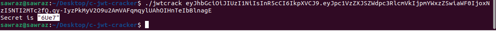
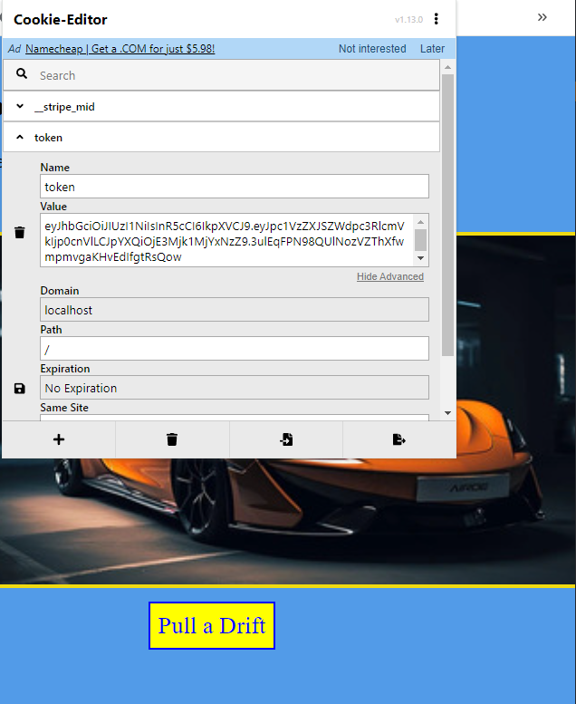

### Challenge title: Secrets of the Fallen Drive-2

#### Points: 200 to 150

#### Flag:

```
 |  BUETCTF{P4ul_r3vs3ngin3s_br0k3_Hm@c_syst3m_fl4g_23cr7y}
```

#### Author: 
##### [C0d3HuNt3r](https://github.com/Shehabul-Islam-Sawraz)

### Challenge Description

---

In Noxhaven, Paul's last garage had a few cracks in its security system, so he’s reinforced the firewall around his prized vault. But there’s still a way in, and I need that flag for my ride...

***Hint:*** 
- What new measures did Paul take to protect his garage's data?

### Solution of Secrets of the Fallen Drive-2

---

- Get started with loading the page

- If we hit the `Enter Garage` Button, we can see Paul's car collections

- From the [previous problem](../Secrets%20of%20the%20Fallen%20Drive/), we already know it will also be related to cookies, with some changes or modifications, as the description says
- Using the [cookie editor](https://chromewebstore.google.com/detail/cookie-editor/hlkenndednhfkekhgcdicdfddnkalmdm?hl=en), we can see a key value pair named **`token`**, which seems to be a JWT token as the previous one

- Let's go to the [**Cyberchef**](https://gchq.github.io/CyberChef/) and apply `JWT Decode`.

- We need to become registered users to the application, to do this, we need to change (in the JWT) the value of the `isUserRegistered` variable from its current value, false, to a new one, **true**.
- But when changing the payload content, without modifying the signature, we get an error (Invalid Signature). 
- So, in order to modify the payload it is necessary to know the key with which the JWT was signed.
- We can see that the token uses ***HS256*** as a Signing Algorithm, by analyzing using [JWT Tool](https://github.com/ticarpi/jwt_tool)
- To get the `Signing Key`, we can use any JWT Cracker, for example [c-jwt-cracker](https://github.com/brendan-rius/c-jwt-cracker) 

- Now we know that **`6Ue7`** its the key for signing the JWT
- Let's sign the new payload with this key

- Now, replace this new token with the existing one using Cookie Editor and save it

- If we click `Pull Drift`, we can see a page with no image, but also no flag!!

- So, going to the inspect, we can find the flag with hidden visibility


