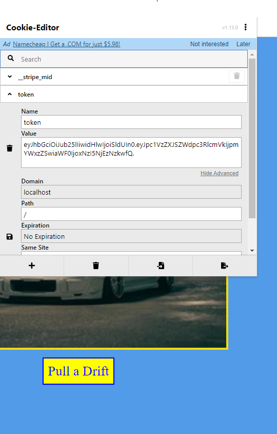
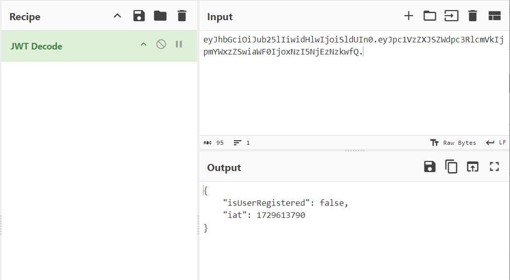
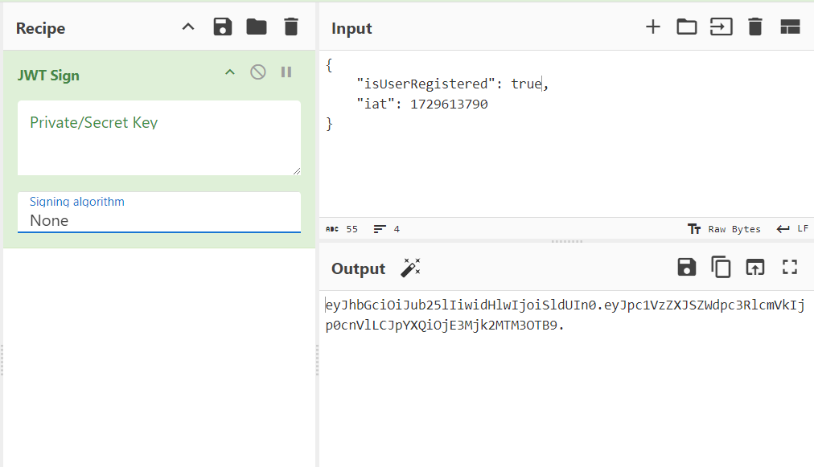
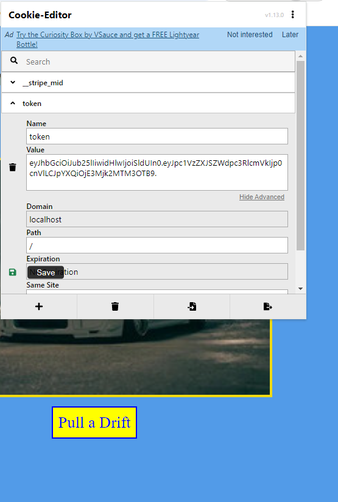

### Challenge title: Secrets of the Fallen Drive

#### Points: 150 to 125

#### Flag:

```
 |  BUETCTF{N0x_G34rsh1ft_F4llC0d3_420_1337}
```

#### Author: 
##### [C0d3HuNt3r](https://github.com/Shehabul-Islam-Sawraz)

### Challenge Description

---

In Noxhaven, where tech has fallen and the streets are ruled by silent engines and hidden eyes, whispers tell of Paul Walker’s garage holding a crucial flag. If you can convince the system that your ride is registered to his exclusive service, you might unlock this lost key to the city's underground circuit.

***Hint:*** 
- Paul’s system knows which cars are registered. Look for how the site tracks its members!

### Solution of Secrets of the Fallen Drive

---

- Get started with loading the page

- If we hit the `Enter Garage` Button, we can see Paul's car collections

- Now, upon reading the description, we get the hint that information of a ride being **registered** is saved somewhere, which can be `cookies`
- Using the [cookie editor](https://chromewebstore.google.com/detail/cookie-editor/hlkenndednhfkekhgcdicdfddnkalmdm?hl=en), we can see a key value pair named **`token`**, which seems to be a JWT token

- Let's go to the [**Cyberchef**](https://gchq.github.io/CyberChef/) and apply `JWT Decode`.

- We need to become registered users to the application, to do this, we need to change (in the JWT) the value of the `isUserRegistered` variable from its current value, false, to a new one, **true**.
- We can see that the token uses ***No Signing Algorithm***, by analyzing using [JWT Tool](https://github.com/ticarpi/jwt_tool)
- So, let's sign the new payload

- Now, replace this new token with the existing one using Cookie Editor and save it

- If we click `Pull Drift`, we can see a page with no image, but also no flag!!

- So, going to the inspect, we can find the flag with hidden visibility
